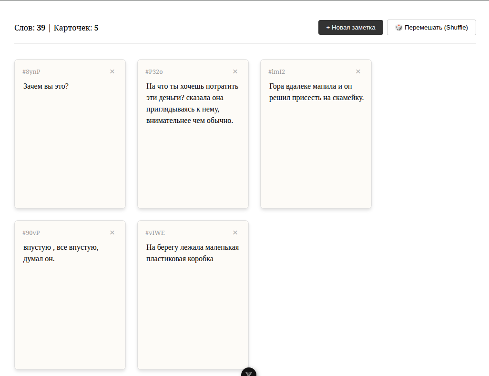

# Nabokov Shuffle

Небольшой Vue 3 + Vite-проект, имитирующий карточки Набокова: можно добавлять, редактировать, удалять заметки и перемешивать их для поиска новых связей. Состояние хранится в `localStorage`, есть счетчик слов и плавная анимация перестановок.

## Скриншот



## Быстрый старт

- Node.js: `^20.19.0 || >=22.12.0`
- Установка зависимостей: `npm install`
- Дев-сервер: `npm run dev`
- Прод-сборка: `npm run build`
- Превью прод-сборки: `npm run preview`
- Линт: `npm run lint`
- Форматирование: `npm run format`

## Что внутри

- `Pinia`-стор `shoebox`: `addCard`, `deleteCard`, `updateCardContent`, `shuffleCards` (Фишер–Йетс), `totalWordCount`.
- Персистентность: `localStorage` с ключом `nabokov-cards`.
- Компоненты: `TheDesk` (панель + сетка) и `NoteCard` (редактирование, удаление).
- Анимации: `TransitionGroup` с префиксом `cards-shuffle` для плавного движения карточек.
- Внешний вид: несколько цветовых схем карточек, пустое состояние, шрифтовая эстетика пишущей машинки.

## Подключение базы данных Supabase (PostgreSQL)

```bash
npm install @supabase/supabase-js
```

```.env
# URL твоего проекта
VITE_SUPABASE_URL=https://твои-цифры.supabase.co

# Публичный ключ (anon public)
VITE_SUPABASE_ANON_KEY=твой-длинный-ключ
```

### Вопрос: где взять VITE_SUPABASE_URL=https://твои-цифры.supabase.co?


Это находится в панели управления твоим проектом на сайте Supabase.

1.  Зайди на [supabase.com](https://supabase.com/dashboard/projects) и открой свой проект `nabokov-shuffle`.
2.  В левом меню в самом низу нажми на иконку шестеренки **Settings** (Настройки).
3.  В открывшемся меню выбери раздел **API**.
4.  На этой странице ты увидишь блок **Project URL**:
    *   Вот это и есть твой `URL`: `https://xxxxxxxxxxxx.supabase.co`. Скопируй его в `.env` напротив `VITE_SUPABASE_URL`.
5.  Ниже будет блок **Project API keys**:
    *   Там два ключа: `anon` (public) и `service_role` (secret).
    *   Тебе нужен тот, что подписан `anon` `public`. Скопируй его в `.env` напротив `VITE_SUPABASE_ANON_KEY`.

**Внимание:** Ключ `service_role` не копируй и никуда не вставляй.


